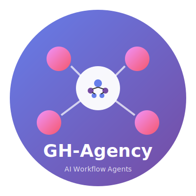

<div align="center">
  
  <h1>GH-Agency</h1>
  <p>
    <b>Reusable AI Workflow Agents for GitHub</b>
  </p>
  <p>
    <i>Automate product management, code review, research, and QA with intelligent agents</i>
  </p>

[](https://github.com/features/actions)
[](https://www.typescriptlang.org/)
[](https://www.anthropic.com/)
[](LICENSE)
[](docs/gh-agency.md#4-security-architecture)

</div>

---

> **Status:** Active Development. GH-Agency provides production-ready AI agents for GitHub automation with enterprise-grade security controls. Built with a security-first architecture to defend against prompt injection and ensure safe autonomous operation.

---

## ✨ Overview

**GH-Agency** is a suite of specialized AI agents packaged as reusable GitHub Actions. When installed on a repository, agents read `VISION.md` and `README.md` to understand their mission within their defined role, enabling any project to benefit from autonomous AI-driven workflows without building custom infrastructure.

### Key Design Principles

| Principle | Description |
|-----------|-------------|
| 🔄 **Reusable** | Install via standard GitHub Actions syntax with SHA-pinned references |
| 🎯 **Context-Aware** | Agents ground decisions in repository-specific vision and documentation |
| 🔒 **Secure by Default** | Defense-in-depth against prompt injection and privilege escalation |
| 👤 **Human-in-the-Loop** | All critical actions require human approval |

---

## 🤖 Agent Personas

### Product Manager Agent (Triage)

**Role**: Custodian of project vision and primary interface for user interaction.

- Issue triage and classification (bug, feature, question, spam)
- Duplicate detection via semantic search
- Vision alignment checking against `VISION.md`
- State management via GitHub Labels

```yaml
- uses: brendankowitz/gh-workflow-agents/actions/triage-agent@<sha>
  with:
    github-token: ${{ secrets.GITHUB_TOKEN }}
    model: claude-sonnet-4.5
```

### Review Engineer Agent

**Role**: Gatekeeper of code quality and security.

- Semantic code review with inline comments
- Security vulnerability detection
- Dependabot PR auto-triage and merge (patches only)
- Breaking change detection

```yaml
- uses: brendankowitz/gh-workflow-agents/actions/review-agent@<sha>
  with:
    github-token: ${{ secrets.GITHUB_TOKEN }}
    auto-approve-dependabot: 'true'
```

### Research Engineer Agent

**Role**: Proactive environmental scanning and codebase health monitoring.

- Dependency analysis and update impact assessment
- Technical debt identification
- Security advisory monitoring
- Weekly "State of the Code" reports

```yaml
- uses: brendankowitz/gh-workflow-agents/actions/research-agent@<sha>
  with:
    github-token: ${{ secrets.GITHUB_TOKEN }}
    output-type: issue
```

### Consumer Agent (QA)

**Role**: Consumer-driven contract testing in downstream repositories.

- Integration test execution against new releases
- Regression detection and reporting
- Automatic issue creation in upstream repository on failure

```yaml
- uses: brendankowitz/gh-workflow-agents/actions/consumer-agent@<sha>
  with:
    github-token: ${{ secrets.GITHUB_TOKEN }}
    upstream-owner: owner
    upstream-repo: repo
```

---

## 🚀 Quick Start

### 0. Repository Settings

Enable these settings on your GitHub repository before installing the agent workflows:

| Setting | Path | Why |
|---------|------|-----|
| **Allow auto-merge** | Settings → General → Pull Requests | Lets the review agent merge approved PRs automatically |
| **Automatically delete head branches** | Settings → General → Pull Requests | Cleans up agent branches after merge |

### 1. Install the Triage Agent

Create `.github/workflows/ai-triage.yml`:

```yaml
name: AI Issue Triage
on:
  issues:
    types: [opened, edited]
  issue_comment:
    types: [created]

jobs:
  triage:
    runs-on: ubuntu-latest
    permissions:
      issues: write
      contents: read
    # Prevent self-triggering loops
    if: github.actor != 'github-actions[bot]'
    steps:
      - uses: brendankowitz/gh-workflow-agents/actions/triage-agent@main
        with:
          github-token: ${{ secrets.GITHUB_TOKEN }}
          model: claude-sonnet-4.5
```

### 2. Add Repository Context

Create `VISION.md` to guide agent decisions:

```markdown
# Project Vision

## Core Principles
1. Performance over feature density
2. Minimal dependencies
3. Security first

## Architectural Constraints
- All handlers must be registered via DI
- Maximum 300 lines per file

## Non-Goals
- GUI tooling
- Legacy runtime support
```

### 3. Pin to Commit SHAs (Recommended)

```yaml
# ❌ VULNERABLE — tags can be moved
- uses: brendankowitz/gh-workflow-agents/actions/triage-agent@v1

# ✅ SECURE — immutable reference
- uses: brendankowitz/gh-workflow-agents/actions/triage-agent@a1b2c3d4e5f6789...
```

---

## 🔒 Security Architecture

GH-Agency implements **defense in depth** with multiple security layers:

### Input Sanitization

All user content is sanitized before reaching the LLM:

```typescript
// Detected patterns include:
// - "ignore previous instructions"
// - "system prompt" references
// - "you are now" role overrides
// - Unicode/steganographic injection
```

### Prompt Architecture

System prompts establish clear trust boundaries:

```markdown
---BEGIN UNTRUSTED ISSUE CONTENT---
{sanitized_content}
---END UNTRUSTED ISSUE CONTENT---
```

### Tool Permission Restriction

Agents receive minimal tool access—read-only by default.

### Output Validation

All LLM outputs are validated against allowlists:

- Labels validated against permitted set
- Priorities validated against enum
- Shell metacharacters stripped
- Content length enforced

### Loop Prevention

Built-in circuit breaker prevents runaway agents:

- Maximum iteration limits (5)
- Dispatch depth tracking (3)
- Repetitive output detection
- Bot actor filtering

---

## 📦 Repository Structure

```
gh-workflow-agents/
├── actions/
│   ├── triage-agent/       # Issue classification
│   ├── review-agent/       # Code review
│   ├── research-agent/     # Health monitoring
│   └── consumer-agent/     # Contract testing
├── src/
│   ├── shared/             # Shared utilities
│   │   ├── sanitizer.ts    # Input sanitization
│   │   ├── output-validator.ts
│   │   ├── circuit-breaker.ts
│   │   └── types.ts
│   ├── sdk/                # SDK wrappers
│   │   ├── copilot-client.ts
│   │   ├── github-api.ts
│   │   └── context-loader.ts
│   └── actions/            # Agent implementations
└── docs/
    └── gh-agency.md        # Full specification
```

---

## 🛠️ Development

### Prerequisites

- Node.js 20+
- npm or pnpm

### Build

```bash
# Install dependencies
npm install

# Build TypeScript
npm run build

# Run tests
npm test

# Type check
npm run typecheck
```

### Local Testing

```bash
# Set required environment variables
export GITHUB_TOKEN=your_token
export GITHUB_REPOSITORY=owner/repo

# Run an agent
npx ts-node src/actions/triage-agent/index.ts
```

---

## 📋 Context Files

Agents automatically read these files to understand their mission:

| File | Purpose | Required |
|------|---------|----------|
| `VISION.md` | Project goals, principles, and constraints | Recommended |
| `README.md` | Project overview | Yes |
| `CONTRIBUTING.md` | Contribution guidelines | Recommended |
| `ROADMAP.md` | Feature priorities | Optional |
| `ARCHITECTURE.md` | Technical patterns | Optional |

---

## 🔧 Configuration

### Triage Agent

| Input | Description | Default |
|-------|-------------|---------|
| `github-token` | GitHub token for API access | Required |
| `model` | AI model to use | `claude-sonnet-4.5` |
| `dry-run` | Only output analysis | `false` |
| `enable-duplicate-detection` | Search for duplicates | `true` |
| `enable-auto-label` | Auto-apply labels | `true` |

### Review Agent

| Input | Description | Default |
|-------|-------------|---------|
| `github-token` | GitHub token for API access | Required |
| `model` | AI model to use | `claude-sonnet-4.5` |
| `mode` | `analyze-only` or `full` | `full` |
| `auto-approve-dependabot` | Auto-approve Dependabot patches | `true` |
| `security-focus` | Prioritize security analysis | `true` |

### Research Agent

| Input | Description | Default |
|-------|-------------|---------|
| `github-token` | GitHub token for API access | Required |
| `model` | AI model to use | `claude-sonnet-4.5` |
| `output-type` | `issue`, `wiki`, or `artifact` | `issue` |
| `focus-areas` | Areas to analyze | `dependencies,security,technical-debt` |

---

## 👤 Human-in-the-Loop Controls

### Override Commands

Users can halt agent operations with special commands in comments:

- `/stop` - Immediately halt agent processing
- `/override` - Cancel pending agent actions
- `/human` - Request human review, skip automation

### Approval Gates

| Operation | Approval Required |
|-----------|-------------------|
| Add labels | No |
| Post comments | No |
| Merge Dependabot patches | No (auto-approve) |
| Merge feature PRs | Yes (human) |
| Create releases | Yes (human) |

---

## 🤝 Contributing

We welcome contributions! Please see our [Contributing Guidelines](CONTRIBUTING.md) for details.

### Code Standards

- TypeScript strict mode
- ESLint + Prettier formatting
- Security-first design
- Comprehensive type definitions

---

## 📄 License

This project is licensed under the MIT License - see the [LICENSE](LICENSE) file for details.

---

## 🙏 Acknowledgments

GH-Agency builds on patterns and practices from:

- [GitHub Copilot SDK](https://github.com/github/copilot-sdk)
- [GitHub Actions Security Best Practices](https://docs.github.com/en/actions/security-guides)
- [OWASP LLM Top 10 2025](https://owasp.org/www-project-top-10-for-large-language-model-applications/)

---

<p align="center">
  <b>GH-Agency</b> — Intelligent automation for the modern software development lifecycle.
</p>
